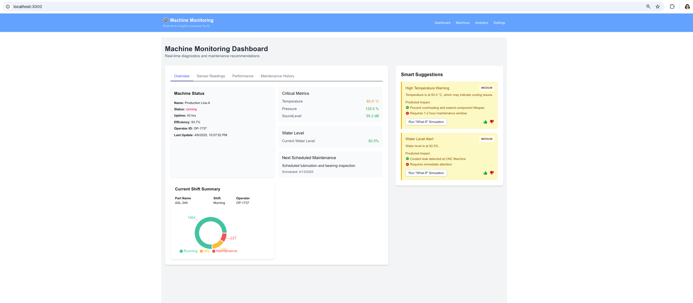

# Real-Time IoT Monitoring and Safety System for Intelligent Machining

Factories need to evolve into smart, automated, and data-driven environments. Current systems lack real-time monitoring, leading to downtime, inefficient resource use, and poor visibility into machine health.

 
## The challenge:
Use IoT sensors and smart devices to collect and utilize real-time machine and environmental data, enabling better operational insights, predictive maintenance, saving on cost and time, and improved decision-making.

## Our Solution
- Orbitron digitizes conventional CNC machines using an Arduino-powered IoT sensor suite.
- It monitors key parameters like temperature, pressure, vibration, leaks, and tool motion in real time.
- Data is transmitted via a Python-Flask API to a centralized dashboard with live alerts and historical logs.
- This enables predictive maintenance, faster fault response, and full machine visibility, aligning directly with Honeywell’s smart factory vision.

## Project Architecture Overview

| **Layer**           | **Details**                                                                                                                                               |
|---------------------|------------------------------------------------------------------------------------------------------------------------------------------------------------|
| **Hardware Layer**  | - Arduino + Sensors: Temperature, Pressure, Sound Level - `pyserial`: Streams sensor data to backend via USB                                           |
| **Backend**         | - Flask (Python): API server for data ingestion, alerts, and smart suggestions - SQLite: Stores sensor logs and maintenance history                    |
| **ML Layer**        | - Models: XGBoost / Random Forest - Predicts failure causes based on trends - Generates confidence scores and triggers recommendations              |
| **Frontend**        | - Next.js: Real-time dashboard UI - Tabs: Sensor Readings, Performance, Maintenance, Simulation - Recharts: Line and pie chart visualizations       |
| **Communication**   | - `pyserial` → Flask: Real-time sensor streaming - Flask → `Next.js`: REST APIs serve data and suggestions                                              |

# Set-up instructions 

## Installations
`cd frontend`

`npm install`

## Setup sqlite database
`cd backend` 

`sqlite3 db.sqlite3 < init_db.sql`
#### Run backend 
`cd backend`

`python app.py`

#### Run frontend 

`cd frontend`

`npm run dev`

### Send data from IOT sensors to Database 
`cd backend`

`python mock.py`

The dashboard will be available on localhost

## Our Impact 

### Minimizes Downtime
- Detects early signs of abnormal machine behavior for **predictive maintenance**
- Reduces unplanned breakdowns
- Boosts overall machine availability

---

### Reduces Operational Costs
- Prevents emergency repairs that can cost **2x–5x** more than scheduled ones  
- Avoids losses from sudden halts in production  
- Optimizes maintenance frequency — **no more over-servicing**

---

### Saves Time & Resources
- **Real-time alerts** eliminate manual checks — saving **10–15 hours/week/operator**
- **Dashboard** centralizes machine health data — enabling faster decisions  
- **Smart suggestions** reduce troubleshooting time by up to **40%**
- Avoids unexpected failures, saving **$3,000–$10,000 per incident**

---

### Ensures Production Continuity
- Continuous monitoring with instant notifications  
- Enables timely intervention to keep production lines running smoothly

---

### Aligns with Honeywell’s Digital Strategy
- Modernizes legacy machines into **connected, data-driven assets**
- Supports the vision of a **fully digital and autonomous factory floor**
- 

## Demo & Screenshots
▶️ [Watch Demo Video](demo.mp4)

